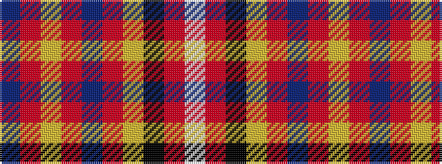

BRYRBRYKRW

It is a 10 stripe tartan.

<figure class="pat-woven">

<figcaption>idealised sample</figcaption>
</figure>

## Colour Sequence



## Tartans with this colour sequence

| Tartans |
|---------------|
| [Selkirk High (Corporate)](/variants/s10/w3m18k18ly1r2b2r2ly1m18b2~x2/)|
||
