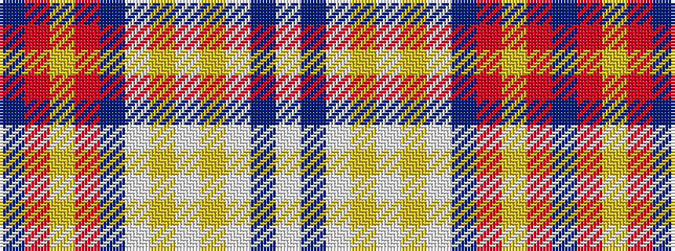

BRYRBWYWYWBW

It is a 12 stripe tartan.

<figure class="pat-woven">

<figcaption>idealised sample</figcaption>
</figure>

## Colour Sequence



## Tartans with this colour sequence

| Tartans |
|---------------|
| [StammBar](/variants/s12/w4b8w4lg8w2lg2w4b42r1ly2r1b2~x2/)|
||
