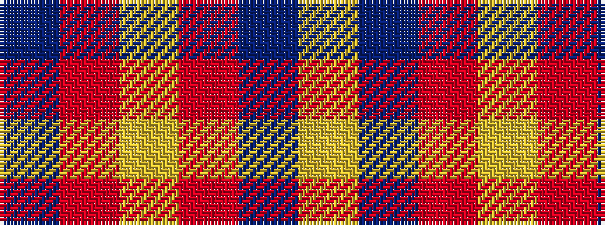

BRYRBY

It is a 6 stripe tartan.

<figure class="pat-woven">

<figcaption>idealised sample</figcaption>
</figure>

## Colour Sequence



## Tartans with this colour sequence

| Tartans |
|---------------|
| [Loevenstein Castle #3](/setts/s6/db40r1lr4r2db8lr24~x2/)|
||
