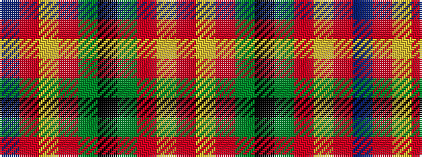

BRYRGKGRYR

It is a 10 stripe tartan.

<figure class="pat-woven">

<figcaption>idealised sample</figcaption>
</figure>

## Colour Sequence



## Tartans with this colour sequence

| Tartans |
|---------------|
| [Harding (Florida) (Personal)](/setts/s10/r50ly7m6g4k4g4m6ly7r50dt13~x2/)|
||
