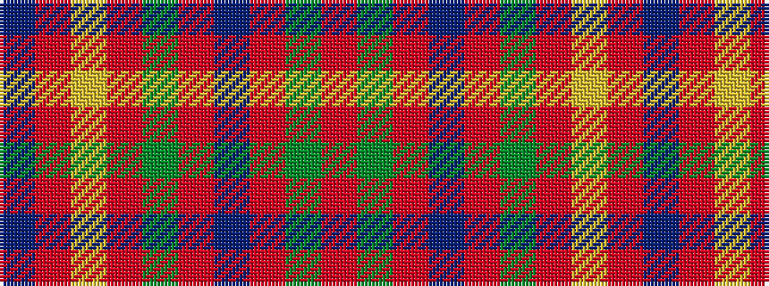

BRYRGRBRGR

It is a 10 stripe tartan.

<figure class="pat-woven">

<figcaption>idealised sample</figcaption>
</figure>

## Colour Sequence



## Tartans with this colour sequence

| Tartans |
|---------------|
| [Tupper., Sir Charles..](/variants/s10/db4o7ly3o12g15o5db20o5g4o2~x2/)|
||
