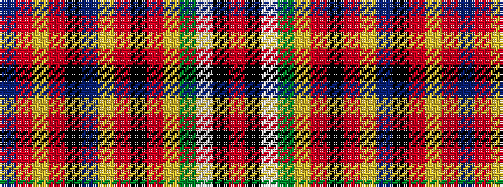

BRYRKBYRKRYGWKR

It is a 15 stripe tartan.

<figure class="pat-woven">

<figcaption>idealised sample</figcaption>
</figure>

## Colour Sequence



## Tartans with this colour sequence

| Tartans |
|---------------|
| [Crubin Plaid (MacPherson)](/setts/s15/r320k4w2g72ly18r8k2r8ly18t72k18r3ly18r8t14/)|
||
| [MacPherson, The Crubin Plaid](/setts/s15/r160k2w1g36ly9r4k1r4ly9t36k9r9ly9r4t3~x2/)|
||
