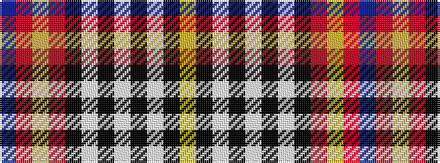

BRYRKWKWKWKY

It is a 12 stripe tartan.

<figure class="pat-woven">

<figcaption>idealised sample</figcaption>
</figure>

## Colour Sequence



## Tartans with this colour sequence

| Tartans |
|---------------|
| [Chieftain, The](/variants/s12/db17r6lo2r6k2w2k2w10k1w2k1lo3~x2/)|
||
