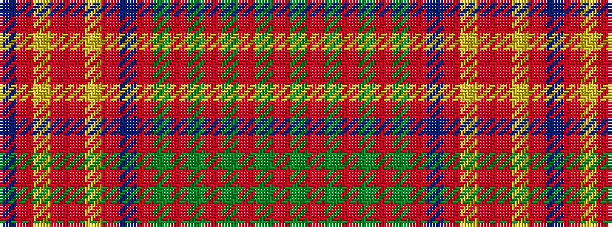

BRYRRYRBRGRGRGRGR

It is a 17 stripe tartan.

<figure class="pat-woven">

<figcaption>idealised sample</figcaption>
</figure>

## Colour Sequence



## Tartans with this colour sequence

| Tartans |
|---------------|
| [Confrerie de Vouvray](/setts/s17/dt8r4ly18r4r19ly4r19dt6r4g1r4g1r4g1r4g1r4~x2/)|
||
