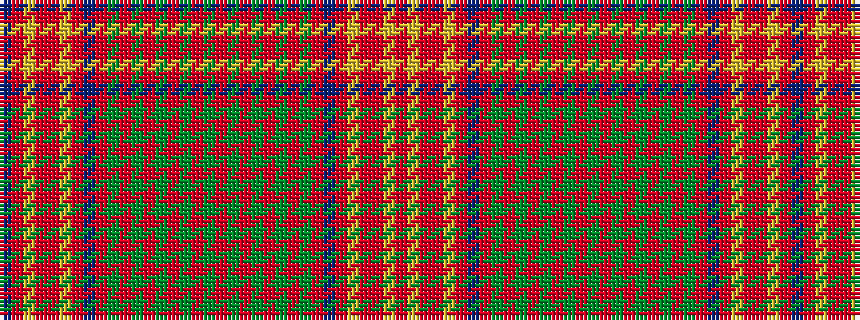

BRYRRYRBRGRGRGRGRGRGRGRGRGRBRYRRYR

It is a 34 stripe tartan.

<figure class="pat-woven">

<figcaption>idealised sample</figcaption>
</figure>

## Colour Sequence



## Tartans with this colour sequence

| Tartans |
|---------------|
| [Confrerie de Vouvray Corporate Tartan](/variants/s34/dt6r3ly14r3ri15ly3ri15dt5ri3g1ri3g1ri3g1ri3g1ri3g1ri3g1ri3g1ri3g1ri3g1ri3dt5ri15ly3ri19r3ly14r3~x2/)|
||
