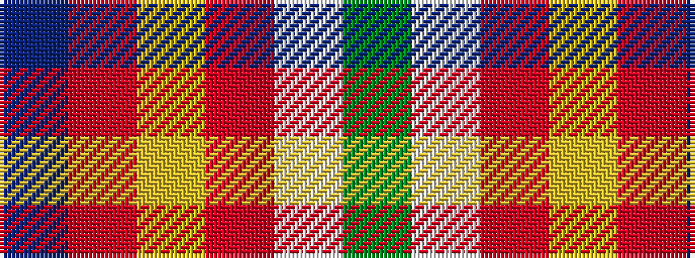

BRYRWG

It is a 6 stripe tartan.

<figure class="pat-woven">

<figcaption>idealised sample</figcaption>
</figure>

## Colour Sequence



## Tartans with this colour sequence

| Tartans |
|---------------|
| [Windy Meadows (Fashion)](/variants/s6/dy45lb2r4ly1o2n2~x4/)|
||
