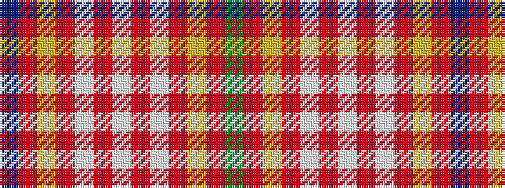

BRYRWRWRWRYRG

It is a 13 stripe tartan.

<figure class="pat-woven">

<figcaption>idealised sample</figcaption>
</figure>

## Colour Sequence



## Tartans with this colour sequence

| Tartans |
|---------------|
| [Delta Dental Association (Corporate)](/variants/s13/g4o1lo29o6w13o13w6o13w13o6lo29o1t4~x2/)|
||
