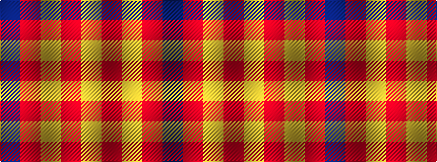

BRYRY

It is a 5 stripe tartan.

<figure class="pat-woven">

<figcaption>idealised sample</figcaption>
</figure>

## Colour Sequence



## Tartans with this colour sequence

| Tartans |
|---------------|
| [Sands-Pingot Family, Alabama (Personal)](/variants/s5/ly6r1ly4r4db2~x5/)|
||
