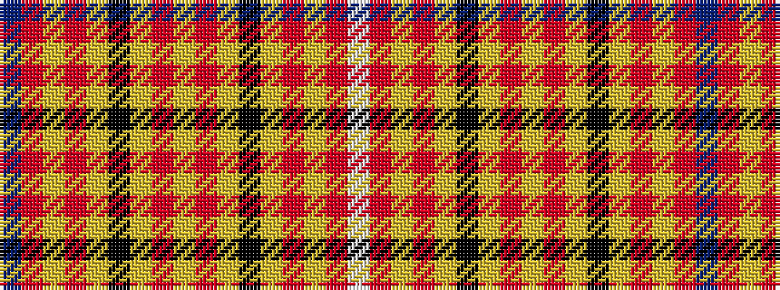

BRYRYKYRYRYKYRYRW

It is a 17 stripe tartan.

<figure class="pat-woven">

<figcaption>idealised sample</figcaption>
</figure>

## Colour Sequence



## Tartans with this colour sequence

| Tartans |
|---------------|
| [Australian, The](/variants/s17/t2o15lo10o4lo2k2lo2o4lo50o4lo2k2lo2o4lo10o15w2~x2/)|
||
