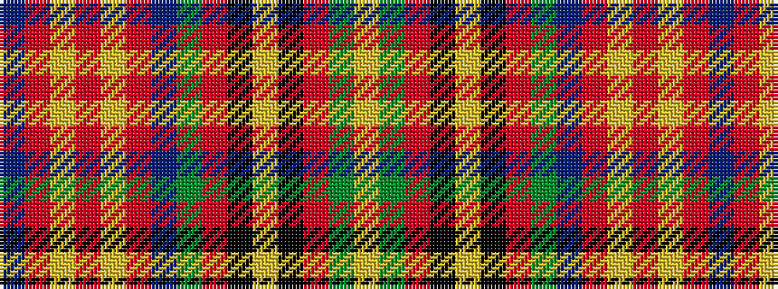

BRYRYRBGRKYKRGY

It is a 15 stripe tartan.

<figure class="pat-woven">

<figcaption>idealised sample</figcaption>
</figure>

## Colour Sequence



## Tartans with this colour sequence

| Tartans |
|---------------|
| [Mungall](/setts/s15/lg27g7r2k7ly2k7r2g7db10r2lg9r3lg2r2db3~x2/)|
||
