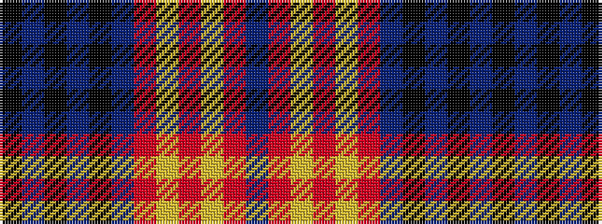

BRYRYRBKBKBK

It is a 12 stripe tartan.

<figure class="pat-woven">

<figcaption>idealised sample</figcaption>
</figure>

## Colour Sequence



## Tartans with this colour sequence

| Tartans |
|---------------|
| [Falkirk](/setts/s12/db8o27ly2r3ly2o27db22k2db4k2db4k4~x2/)|
||
