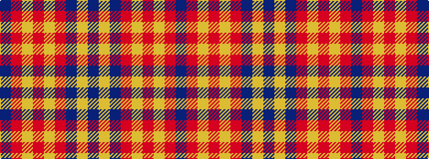

BRYRYRBYB

It is a 9 stripe tartan.

<figure class="pat-woven">

<figcaption>idealised sample</figcaption>
</figure>

## Colour Sequence



## Tartans with this colour sequence

| Tartans |
|---------------|
| [New Breckon (Fashion?)](/variants/s9/dt6lo2dt27r27lo2r2lo2r2dt4~x2/)|
||
