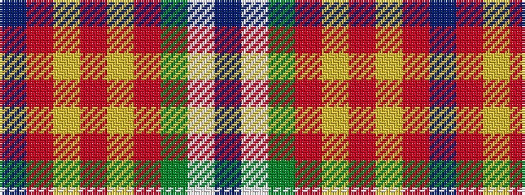

BRYRYRGWB

It is a 9 stripe tartan.

<figure class="pat-woven">

<figcaption>idealised sample</figcaption>
</figure>

## Colour Sequence



## Tartans with this colour sequence

| Tartans |
|---------------|
| [Red Dirt Girl](/setts/s9/do21r2lg18r2lg18r2dg8w6do10~x2/)|
||
