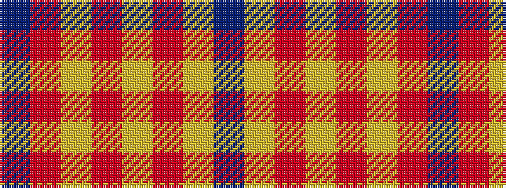

BRYRYRYB

It is a 8 stripe tartan.

<figure class="pat-woven">

<figcaption>idealised sample</figcaption>
</figure>

## Colour Sequence



## Tartans with this colour sequence

| Tartans |
|---------------|
| [Glassary #2](/variants/s8/db4r1ly12r2ly2r12ly1db4~x4/)|
||
