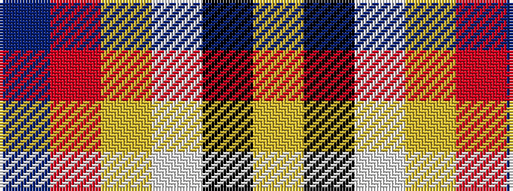

BRYWKY

It is a 6 stripe tartan.

<figure class="pat-woven">

<figcaption>idealised sample</figcaption>
</figure>

## Colour Sequence



## Tartans with this colour sequence

| Tartans |
|---------------|
| [SCH '67 Class](/setts/s6/db3r2lr15w10k2lo3~x2/)|
||
