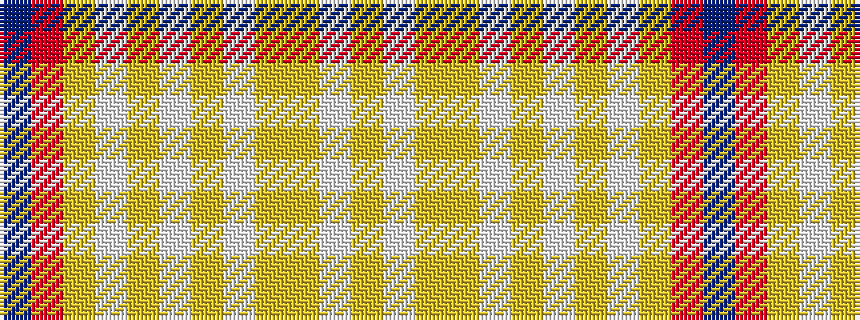

BRYWYWYWYYWY

It is a 12 stripe tartan.

<figure class="pat-woven">

<figcaption>idealised sample</figcaption>
</figure>

## Colour Sequence



## Tartans with this colour sequence

| Tartans |
|---------------|
| [Gary (Personal)](/variants/s12/dp2r1lo4w2lo12w8lo12w2lo2lo2w1lo2~x4/)|
||
