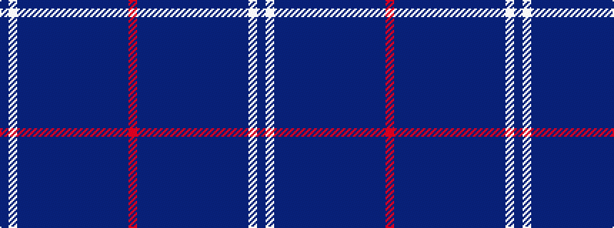

BWBBBBBBBBBBBBBR

It is a 16 stripe tartan.

<figure class="pat-woven">

<figcaption>idealised sample</figcaption>
</figure>

## Colour Sequence



## Tartans with this colour sequence

| Tartans |
|---------------|
| [Help for Heroes (Corporate)](/variants/s16/r6t25dt10db1dt5db2dt4db3dt3db3dt2db4dt1db16lb6db3~x2/)|
||
