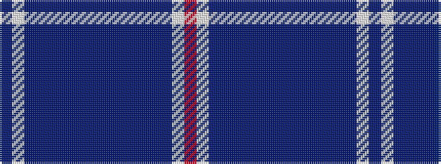

BWBBBBBBBBBBBBWR

It is a 16 stripe tartan.

<figure class="pat-woven">

<figcaption>idealised sample</figcaption>
</figure>

## Colour Sequence



## Tartans with this colour sequence

| Tartans |
|---------------|
| [Help for Heroes Corporate Tartan Tartan Number: 10561. Earliest known date: 20/01/2012 The use of the tartan is restricted in line with a legal agreement between Help for Heroes and Lochcarron of Scotland. Woven by Lochcarron of Scotland This tartan was inspired by William McGregor and George Neil of G B Tailoring, and has been produced to raise funds for Help for Heroes. The colours represent the UK Army, Navy and Airforce See products available Copyright © Blair Urquhart, Comrie, 2015](/setts/s16/r12lt50dt20db2dt10db4dt8db6dt6db6dt4db8dt2db32lb12db5/)|
|![Help for Heroes Corporate Tartan Tartan Number: 10561. Earliest known date: 20/01/2012 The use of the tartan is restricted in line with a legal agreement between Help for Heroes and Lochcarron of Scotland. Woven by Lochcarron of Scotland This tartan was inspired by William McGregor and George Neil of G B Tailoring, and has been produced to raise funds for Help for Heroes. The colours represent the UK Army, Navy and Airforce See products available Copyright © Blair Urquhart, Comrie, 2015 example sett](/setts/s16/r12lt50dt20db2dt10db4dt8db6dt6db6dt4db8dt2db32lb12db5/sett.png)|
