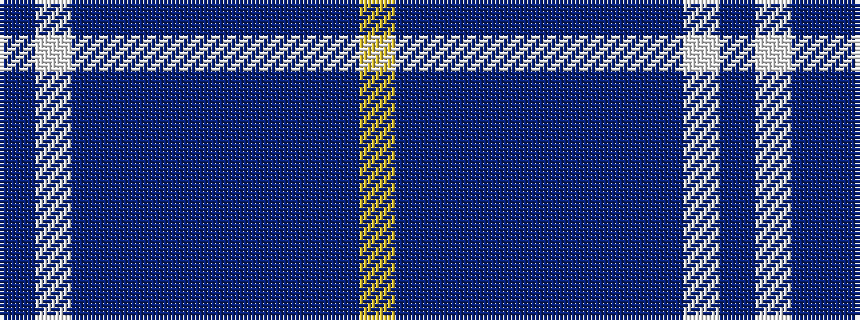

BWBBBBBBBBY

It is a 11 stripe tartan.

<figure class="pat-woven">

<figcaption>idealised sample</figcaption>
</figure>

## Colour Sequence



## Tartans with this colour sequence

| Tartans |
|---------------|
| [Kilmarnock F.C. (Sports)](/setts/s11/dbi4w3dbi4dp3dbi3dp3dbi15db8dbi11db28ly2~x2/)|
||
