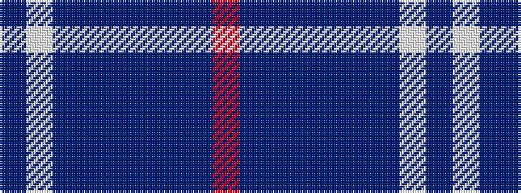

BWBBBBBBR

It is a 9 stripe tartan.

<figure class="pat-woven">

<figcaption>idealised sample</figcaption>
</figure>

## Colour Sequence



## Tartans with this colour sequence

| Tartans |
|---------------|
| [Dauphinee, Andrew Hunter (Personal)](/setts/s9/r3dt32db2dt3db4dt2db16w1db1~x2/)|
||
