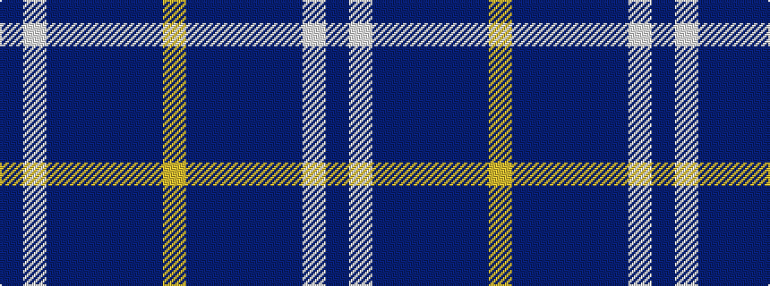

BWBBBBBY

It is a 8 stripe tartan.

<figure class="pat-woven">

<figcaption>idealised sample</figcaption>
</figure>

## Colour Sequence



## Tartans with this colour sequence

| Tartans |
|---------------|
| [Banff & Buchan (District)](/variants/s8/b17lb2b3db16t28db2t3lo2~x2/)|
||
| [Banff and Buchan District Tartan](/variants/s8/db26w2db3dbi15t26dbi2t3ly4~x2/)|
||
| [Banff, and Buchan](/variants/s8/dbi26w2dbi3db15t26db2t3ly4~x2/)|
||
