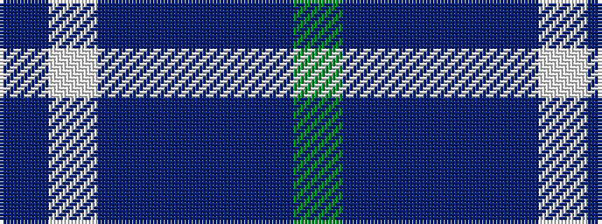

BWBBBBG

It is a 7 stripe tartan.

<figure class="pat-woven">

<figcaption>idealised sample</figcaption>
</figure>

## Colour Sequence



## Tartans with this colour sequence

| Tartans |
|---------------|
| [JetBlue (Corporate)](/setts/s7/db4w3b6db40b8db12g3~x2/)|
||
