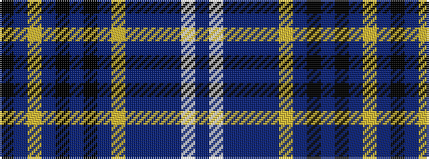

BWBBBBYBKBKBYBK

It is a 15 stripe tartan.

<figure class="pat-woven">

<figcaption>idealised sample</figcaption>
</figure>

## Colour Sequence



## Tartans with this colour sequence

| Tartans |
|---------------|
| [Scottish Register of Tartans Corporate Tartan Tartan Number: 10000. Earliest known date: Jun. 2008 Designed to celebrate the launch of the first Scottish Register of Tartans in November 2008. The colours are those associated with the Matheson Dome, the National Archives' major repository of books very many of which are covered with dark brown leather (buckram) and with red and gold labelling. The light parchment colour represents the parchment paper in the books and the black relates to the book shelves. Permission of the Keeper of the Scottish Register of Tartans must be sought before this tartan can be reproduced in any form. See products available Copyright © Blair Urquhart, Comrie, 2015](/setts/s15/dr11w4dr8do1dr1do28lo2do28k2do2k23dr3lo6dr3k5~x2/)|
|![Scottish Register of Tartans Corporate Tartan Tartan Number: 10000. Earliest known date: Jun. 2008 Designed to celebrate the launch of the first Scottish Register of Tartans in November 2008. The colours are those associated with the Matheson Dome, the National Archives' major repository of books very many of which are covered with dark brown leather (buckram) and with red and gold labelling. The light parchment colour represents the parchment paper in the books and the black relates to the book shelves. Permission of the Keeper of the Scottish Register of Tartans must be sought before this tartan can be reproduced in any form. See products available Copyright © Blair Urquhart, Comrie, 2015 example sett](/setts/s15/dr11w4dr8do1dr1do28lo2do28k2do2k23dr3lo6dr3k5~x2/sett.png)|
