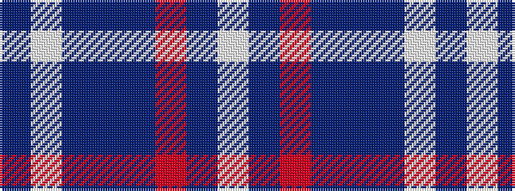

BWBBBRBW

It is a 8 stripe tartan.

<figure class="pat-woven">

<figcaption>idealised sample</figcaption>
</figure>

## Colour Sequence



## Tartans with this colour sequence

| Tartans |
|---------------|
| [Pride of the Clyde](/variants/s8/db8w4dt6db2dt6o10dt63w3/)|
||
