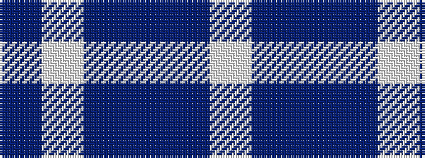

BWBBBW

It is a 6 stripe tartan.

<figure class="pat-woven">

<figcaption>idealised sample</figcaption>
</figure>

## Colour Sequence



## Tartans with this colour sequence

| Tartans |
|---------------|
| [Loch Ness Water](/variants/s6/lb3t11db8t10lb6dp1~x2/)|
||
