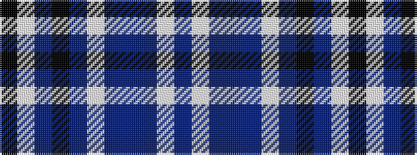

BWBBBWBKBWK

It is a 11 stripe tartan.

<figure class="pat-woven">

<figcaption>idealised sample</figcaption>
</figure>

## Colour Sequence



## Tartans with this colour sequence

| Tartans |
|---------------|
| [MacKellar Royal Blue Dress Tartan Tartan Number: 8181. Earliest known date: Threadcount and colours aren't 100% original. Generated manually. See products available Copyright © Blair Urquhart, Comrie, 2015](/setts/s11/db23w2db3t4db3w2db5k11p2w23k3~x2/)|
||
