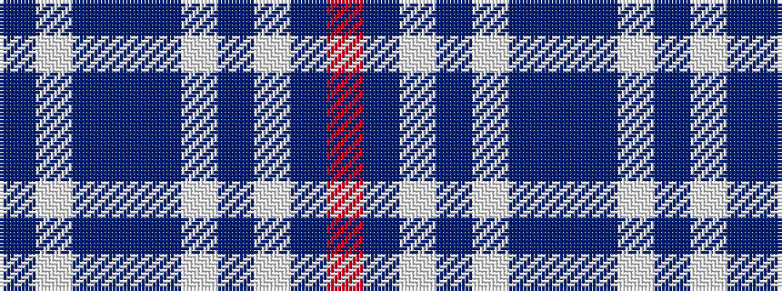

BWBBBWBWBR

It is a 10 stripe tartan.

<figure class="pat-woven">

<figcaption>idealised sample</figcaption>
</figure>

## Colour Sequence



## Tartans with this colour sequence

| Tartans |
|---------------|
| [Rikaco Morning Dew 1 (Fashion)](/setts/s10/db4w2db1t24db10w1db2w5db3r2~x2/)|
||
