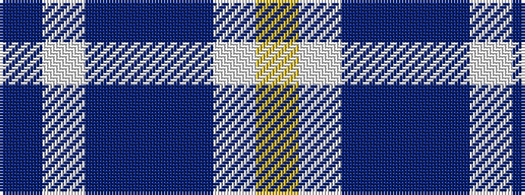

BWBBBWY

It is a 7 stripe tartan.

<figure class="pat-woven">

<figcaption>idealised sample</figcaption>
</figure>

## Colour Sequence



## Tartans with this colour sequence

| Tartans |
|---------------|
| [Muir, John](/setts/s7/ly2w21db16b8db30w8db1~x2/)|
||
