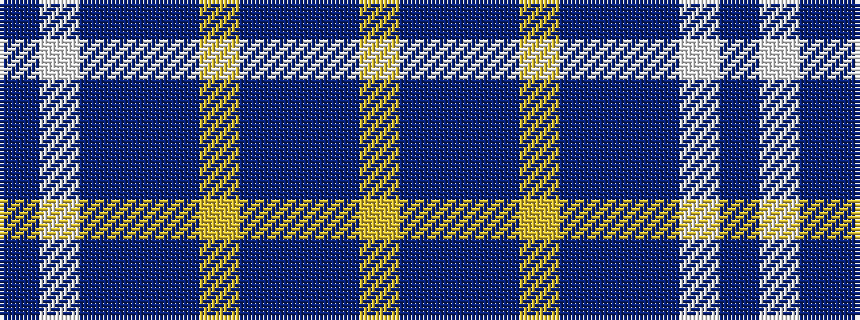

BWBBBYBBBY

It is a 10 stripe tartan.

<figure class="pat-woven">

<figcaption>idealised sample</figcaption>
</figure>

## Colour Sequence



## Tartans with this colour sequence

| Tartans |
|---------------|
| [Learmonth Family (Herts) (Personal)](/setts/s10/p16lp2p5dp12p8lg2db4p8dp23lg4~x2/)|
||
