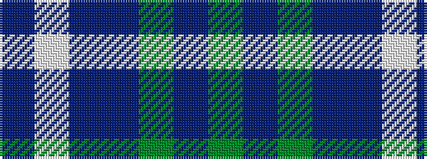

BWBBGBG

It is a 7 stripe tartan.

<figure class="pat-woven">

<figcaption>idealised sample</figcaption>
</figure>

## Colour Sequence



## Tartans with this colour sequence

| Tartans |
|---------------|
| [United Colours of Scotland (Corporat](/variants/s7/dg7db3dg7dt22db22w3db5~x2/)|
||
