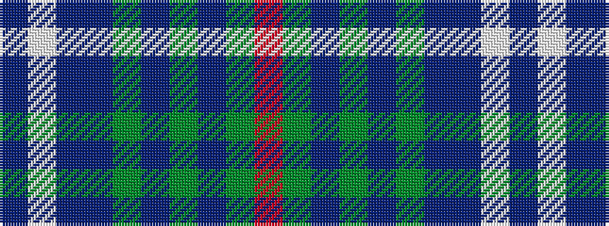

BWBBGBGBGR

It is a 10 stripe tartan.

<figure class="pat-woven">

<figcaption>idealised sample</figcaption>
</figure>

## Colour Sequence



## Tartans with this colour sequence

| Tartans |
|---------------|
| [State Seal of Tennessee (Fashion)](/setts/s10/db70lb6db5db16g10b27g4b4g1r4~x2/)|
||
