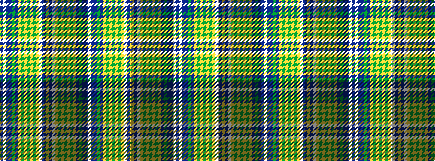

BWBBGBYGYGYGYWBYBWYGYGYGYBGBBW

It is a 30 stripe tartan.

<figure class="pat-woven">

<figcaption>idealised sample</figcaption>
</figure>

## Colour Sequence



## Tartans with this colour sequence

| Tartans |
|---------------|
| [All Irish Blue Irish District Tartan](/variants/s30/b6lb2db2b30gi2b2lo2g4lo2gi2lo1gi18lo1lb2db2lo4~x2/)|
||
