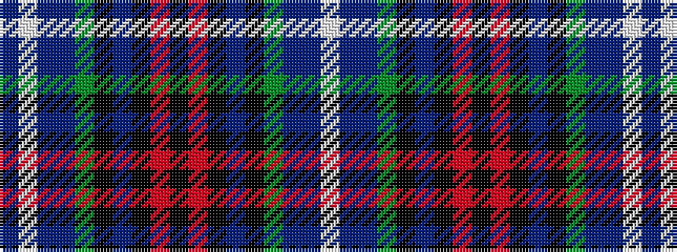

BWBBGKBKRKRKBKGBBW

It is a 18 stripe tartan.

<figure class="pat-woven">

<figcaption>idealised sample</figcaption>
</figure>

## Colour Sequence



## Tartans with this colour sequence

| Tartans |
|---------------|
| [Heart of Scotland (Lochcarron)](/variants/s18/db5w1db44dp1g12k12dp5k2m2k3~x2/)|
||
