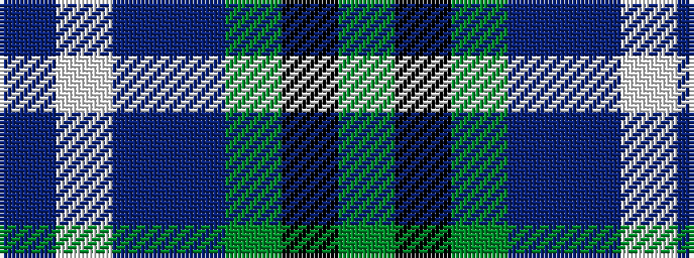

BWBBGKG

It is a 7 stripe tartan.

<figure class="pat-woven">

<figcaption>idealised sample</figcaption>
</figure>

## Colour Sequence



## Tartans with this colour sequence

| Tartans |
|---------------|
| [Lennox Primary School](/variants/s7/dp2lp1dp10db1y10k1y2~x4/)|
||
