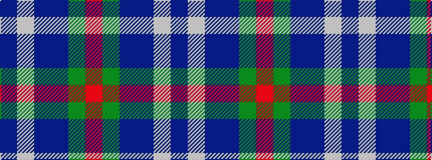

BWBBGR

It is a 6 stripe tartan.

<figure class="pat-woven">

<figcaption>idealised sample</figcaption>
</figure>

## Colour Sequence



## Tartans with this colour sequence

| Tartans |
|---------------|
| [Georgian Bay, Waters of](/setts/s6/db35w3db8t36dg9o3~x2/)|
||
| [Waters of Georgian Bay (District)](/setts/s6/db38w3db8dbi36dg9r3~x2/)|
||
