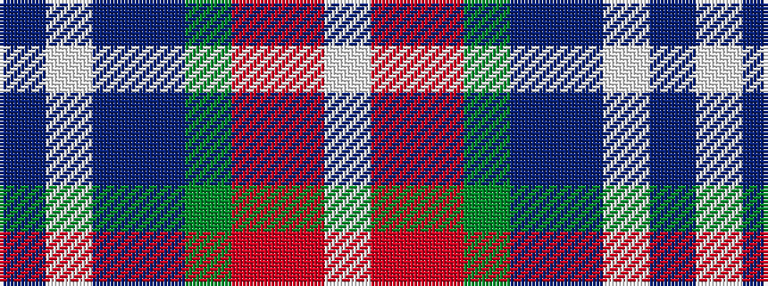

BWBBGRRW

It is a 8 stripe tartan.

<figure class="pat-woven">

<figcaption>idealised sample</figcaption>
</figure>

## Colour Sequence



## Tartans with this colour sequence

| Tartans |
|---------------|
| [Hier Family, Kilcreggan (Personal)](/setts/s8/db45w2t23db10dg2r1m5w1~x2/)|
||
