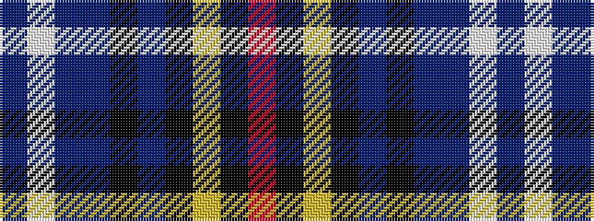

BWBBKBKYKR

It is a 10 stripe tartan.

<figure class="pat-woven">

<figcaption>idealised sample</figcaption>
</figure>

## Colour Sequence



## Tartans with this colour sequence

| Tartans |
|---------------|
| [Cumnock Hunting (District)](/setts/s10/dp23w1dp2db16k3db2k30lo1k2r3~x2/)|
||
