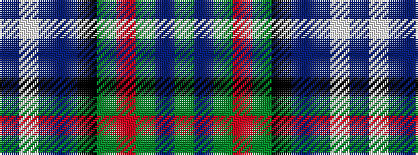

BWBBKGRGBG

It is a 10 stripe tartan.

<figure class="pat-woven">

<figcaption>idealised sample</figcaption>
</figure>

## Colour Sequence



## Tartans with this colour sequence

| Tartans |
|---------------|
| [Scotland the Brave Corporate Tartan](/variants/s10/dt6w1dt40dp1k12dg12m6dg2dr2dg4~x2/)|
||
