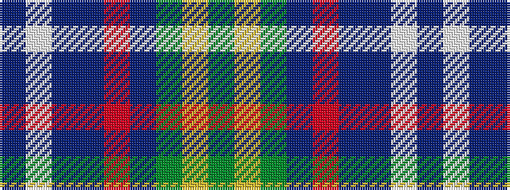

BWBBRBGYG

It is a 9 stripe tartan.

<figure class="pat-woven">

<figcaption>idealised sample</figcaption>
</figure>

## Colour Sequence



## Tartans with this colour sequence

| Tartans |
|---------------|
| [Royal Columbian Canadian Tartan](/variants/s9/db25w2db25t25r2t25g25ly2g25~x2/)|
||
