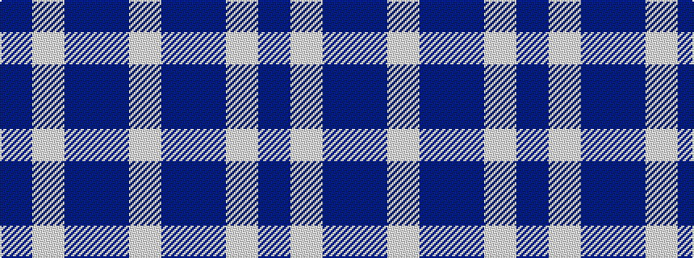

BWBBW

It is a 5 stripe tartan.

<figure class="pat-woven">

<figcaption>idealised sample</figcaption>
</figure>

## Colour Sequence



## Tartans with this colour sequence

| Tartans |
|---------------|
| [Glen App Trade Tartan](/variants/s5/dp37w9dp3dr9w3~x2/)|
||
| [Laval (Tartan de..)](/variants/s5/db2w2dr8db8w1~x2/)|
||
| [Laval, Tartan de](/variants/s5/db1lb1dr4db4lb1~x4/)|
||
| [Loch Lomond](/variants/s5/t37w9t3db9w3~x2/)|
||
