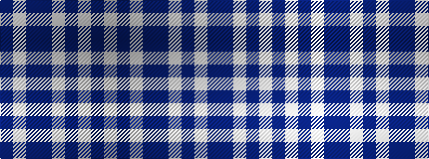

BWBBWBWB

It is a 8 stripe tartan.

<figure class="pat-woven">

<figcaption>idealised sample</figcaption>
</figure>

## Colour Sequence



## Tartans with this colour sequence

| Tartans |
|---------------|
| [Laval (Tartan de..), dress](/variants/s8/db2w2db8dr8w10db2w1db1~x2/)|
||
| [Laval Dress, Tartan de](/variants/s8/db2lb2db7dr8lb10db2lb2db2~x2/)|
||
