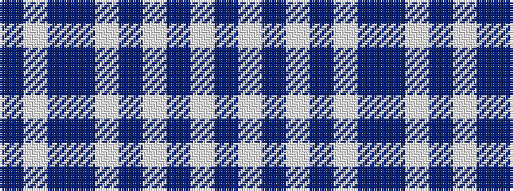

BWBBWBWBWB

It is a 10 stripe tartan.

<figure class="pat-woven">

<figcaption>idealised sample</figcaption>
</figure>

## Colour Sequence



## Tartans with this colour sequence

| Tartans |
|---------------|
| [Fraser Arisaid #2](/variants/s10/dt14w2dt3w2dr10w32dr10dt10w2dt3~x2/)|
||
