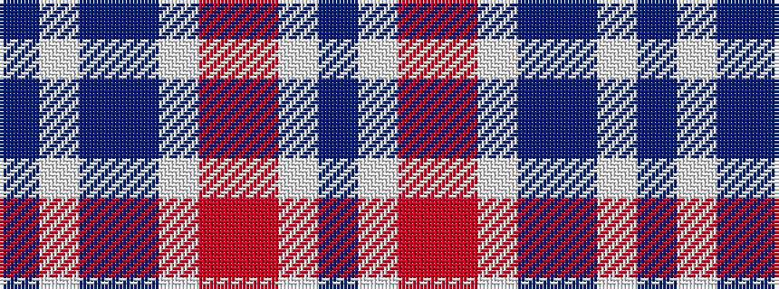

BWBBWRRWB

It is a 9 stripe tartan.

<figure class="pat-woven">

<figcaption>idealised sample</figcaption>
</figure>

## Colour Sequence



## Tartans with this colour sequence

| Tartans |
|---------------|
| [Cole-Dale (Personal)](/variants/s9/t8w4t8db2lt8r1m1lt8db2/)|
||
