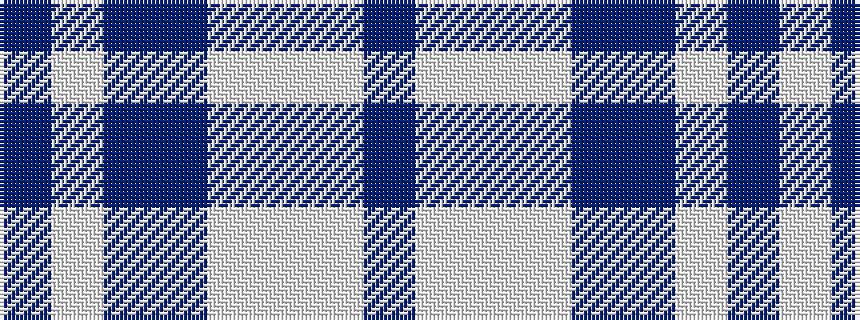

BWBBWWWB

It is a 8 stripe tartan.

<figure class="pat-woven">

<figcaption>idealised sample</figcaption>
</figure>

## Colour Sequence



## Tartans with this colour sequence

| Tartans |
|---------------|
| [Eildon (1980)](/setts/s8/db42lb2lb2lb2db5db12lb32db4~x2/)|
||
| [Longniddry Blue (Dance)](/setts/s8/dt42lb2lb2lb2dt5dt12lb32dt4~x2/)|
||
| [Longniddry Dress (Dance)](/setts/s8/dp42lb2w2lb2dp5t12w32dp4~x2/)|
||
| [Longniddry Eildon Blue Dress Fancy Tartan Tartan Number: 5486. Earliest known date: pre 1992 Dancers tartan See products available Copyright © Blair Urquhart, Comrie, 2015](/setts/s8/db42lb2lb2lb2db5dt12lb32db4~x2/)|
||
