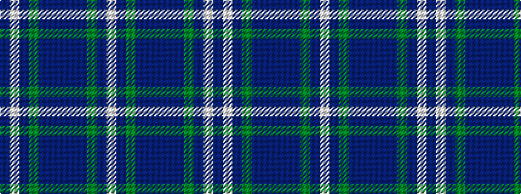

BWBGBBBBBGBW

It is a 12 stripe tartan.

<figure class="pat-woven">

<figcaption>idealised sample</figcaption>
</figure>

## Colour Sequence



## Tartans with this colour sequence

| Tartans |
|---------------|
| [Dickson Name Tartan](/variants/s12/n6db8n8g12dt29w3dt4~x2/)|
||
