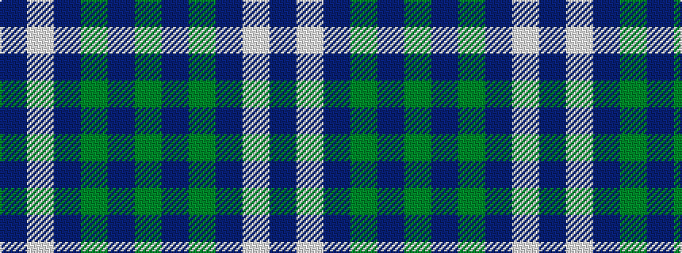

BWBGBG

It is a 6 stripe tartan.

<figure class="pat-woven">

<figcaption>idealised sample</figcaption>
</figure>

## Colour Sequence



## Tartans with this colour sequence

| Tartans |
|---------------|
| [Unidentified Tweed](/variants/s6/dg4db1dg12db12w1db4~x2/)|
||
| [Unidentified, Tweed](/variants/s6/db4w1db12g12db1g4~x2/)|
||
